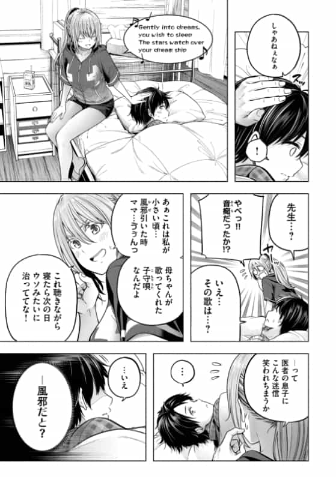
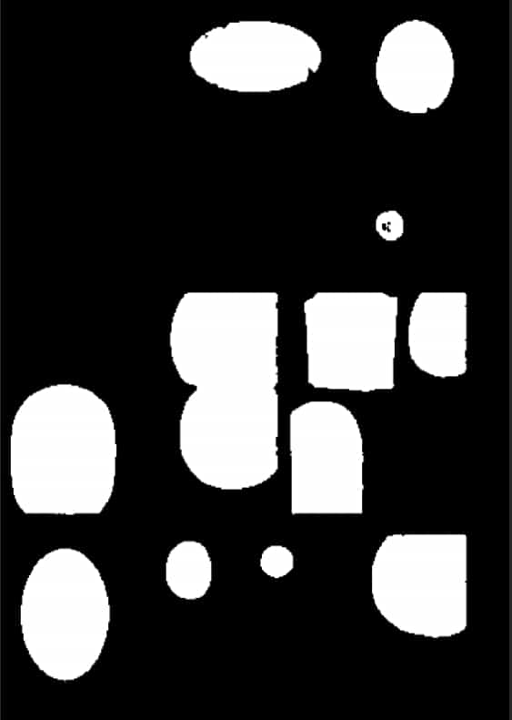
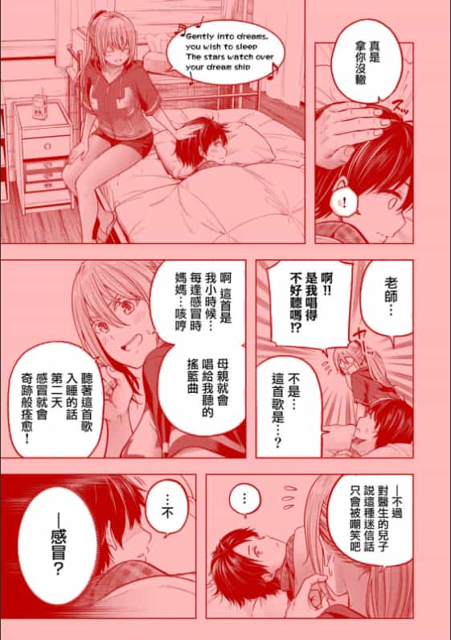
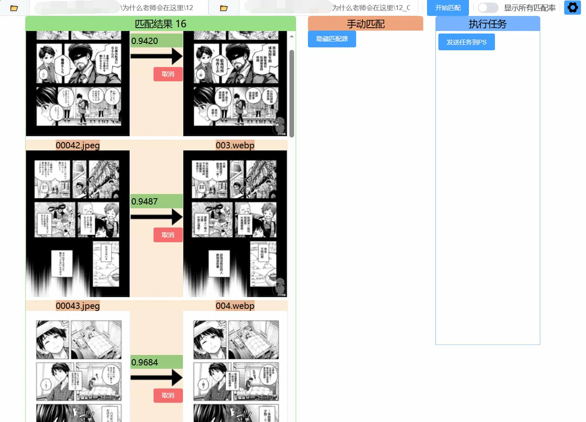
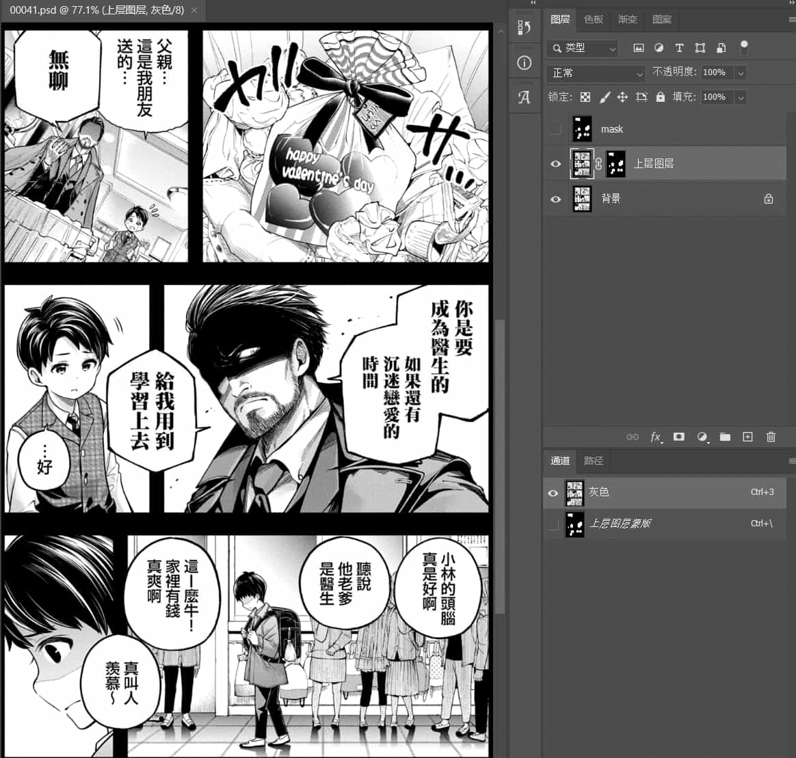

# manga-remake
## 一、描述
本项目旨在实现：高清原图 + 已翻译但画质差的图 => 高清已翻译图片。<br>
原理：训练模型生成对话框的蒙版（MASK），调用PS自动批量执行。<br><br>

| 原图 | 识别对话框 | 应用蒙版 |
| :---: | :---: | :---: |
|  |  |  |

## 二、实现效果：
| 图片匹配 | PSD生成 |
| :---:| :---: |
|  |  |

## 三、使用
### 前提
需要提前安装PS，本人使用的是PS2022，其他较新的版本理论上也可以（未测试）
### 方法一
下载打包好的文件（仅可调用），解压直接运行`start.bat`

### 方法二
下载本项目，安装环境（可重新训练模型），然后运行：
```bash
pip install -r requirements.txt

python web.py
```
如果生成的requirements有缺漏，那就自行安装吧。<br>
注意：如果`pillow-avif-plugin`安装时编译失败，可用去找镜像源里找现成的`whl`包。


### 使用步骤
1. 运行后，使用Edge或Chrome浏览器访问：http://127.0.0.1:5000
2. 输入文件夹路径
3. 点击`开始匹配`按钮，等待匹配结果
4. 检查匹配结果，如果匹配不对，请在设置按钮中调整`匹配阈值`，或手动点击匹配项的`取消`按钮，或从`手动匹配`栏拖动图片
5. 设置生成PSD时的参数
6. 确定好`匹配结果`旁边的数字，这是`发送任务到PS`执行的图片组，规则是“匹配图不为空+匹配率大于阈值”
7. 点击`发送任务到PS`，会在原图目录下生成一个`auto_PSD`文件夹，生成的PSD存放于此
8. 定期清理`temp_mask`文件夹，这是MASK的临时目录

## 四、已实现功能
- 生成PSD时自动对齐图层（使用的是PS自带的功能）
- 生成PSD时判断是否为黑白图，如果是，可选择性转为灰度图
- 在前端控制对图层调整或使用“色阶”、“表面模糊”、“USM锐化”、“指定的动作”

## 五、训练
如果想要自己训练模型，需准备好数据集，这里提供本人标记的数据集PSD，需使用`其他脚本/导出图片.py`这个脚本导出为png。<br>
数据集下载地址：[manga-remake-dataset](https://drive.google.com/drive/folders/1n2aPlhTrt2CwgGau8jCd6pWKGu3H-pW5?usp=sharing )（使用者限18岁以上，且仅供学习使用，下载后请于24小时内删除）<br>
- 2026-01-11 数据集数量：1332（英文530张 + 日文802张）

## 叠甲
1. 代码苦手，感谢豆包和Gork~
2. 没有设计美感，UI凑合着用吧
